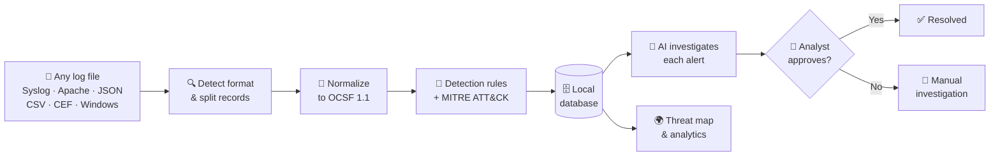
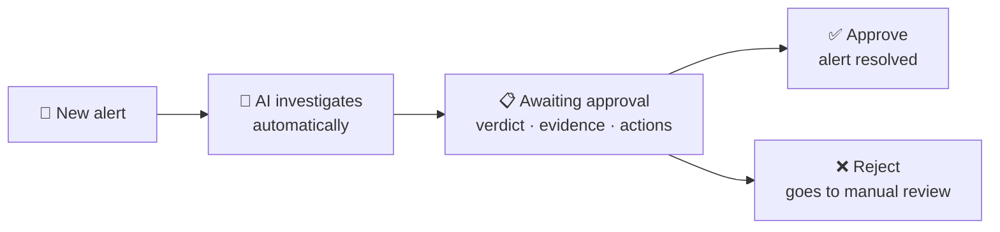

<div align="center">

# 🛡️ LOGVAULT

### Every log format. One schema. AI that investigates — and a human who decides.

**Smart India Hackathon 2026 · Problem Statement SIH26156**

[](#-built-for-air-gapped-networks)
[](#-ai-that-investigates-a-human-who-decides)
[](#-how-it-works)
[](#-try-it-in-2-minutes)

**[The Problem](#-the-problem)** · **[Our Solution](#-our-solution)** · **[Try It](#-try-it-in-2-minutes)** · **[How It Works](#-how-it-works)** · **[Why LOGVAULT](#-why-logvault-is-different)**

</div>

---

## 🎯 The Problem

A Security Operations Center (SOC) receives logs from firewalls, web servers, Linux and Windows machines, cloud platforms and custom devices. **Every source speaks a different format.**

Before anyone can spot an attack, analysts must:

1. 😩 **Read logs in 5+ incompatible formats** by hand
2. 🔍 **Decide which events are real threats** among thousands of normal ones
3. ⏱️ **Investigate every alert manually** — while attackers keep going
4. ☁️ **Rely on cloud SIEM tools** that sensitive networks (defence, power, banking) *are not allowed to use*

---

## 💡 Our Solution

**LOGVAULT turns messy logs into clear, investigated alerts — without the internet.**

<table>
<tr>
<td width="25%" align="center">

### 📥
**1. Ingest**<br>
Drop any log file. LOGVAULT detects the format automatically.

</td>
<td width="25%" align="center">

### 🔄
**2. Normalize**<br>
Every record becomes the same standard shape (OCSF 1.1).

</td>
<td width="25%" align="center">

### 🚨
**3. Detect**<br>
Rules catch attacks and map them to MITRE ATT&CK.

</td>
<td width="25%" align="center">

### 🤖
**4. Investigate**<br>
AI explains each alert. An analyst approves the fix.

</td>
</tr>
</table>

> **In one line:** upload a file with SSH brute-force attempts, SQL injection and XSS mixed with normal traffic — in **~22 ms** LOGVAULT parses all 14 records across 4 formats, flags the 9 attacks, pins them on a world map, and the AI has an investigation ready for an analyst to approve.

---

## ⚡ Try It in 2 Minutes

**Step 1 — Start LOGVAULT** (needs [Docker](https://www.docker.com/products/docker-desktop/))

```bash
docker compose up -d --build
```

**Step 2 — Open** 👉 **http://127.0.0.1:8000/?auth=demo**

**Step 3 — Follow the attack:**

| # | Go to | Do this | You will see |
|:-:|:--|:--|:--|
| 1 | **Log Normalizer** | Upload [`samples/demo-attack.log`](samples/demo-attack.log) | 14 records, 4 formats detected, 9 threats — each mapped to OCSF |
| 2 | **Log Normalizer** | Click any red record | Severity, MITRE technique, threat score and a plain-English explanation |
| 3 | **Alert Center** | Wait a few seconds | The AI has investigated every alert: verdict, root cause, evidence, recommended actions |
| 4 | **Alert Center** | Click **Approve + related** | Six brute-force alerts closed at once — with your name on the decision |
| 5 | **Event Analytics** | Just look | Attacks pinned on a world map (Berlin, Netherlands, Mumbai), activity heatmap, top attackers |

Also try [`samples/cloud-audit.json`](samples/cloud-audit.json) — a cloud audit file in JSON, split and understood automatically.

<details>
<summary><b>Run without Docker</b></summary>

```bash
pip install -r backend/requirements.txt
python -m uvicorn backend.app:app --host 127.0.0.1 --port 8000
```

Tested with Python 3.13. Then open http://127.0.0.1:8000/?auth=demo

</details>

<details>
<summary><b>Turn on the local AI (optional)</b></summary>

LOGVAULT works fully without AI. To add AI explanations, install [Ollama](https://ollama.com) and run:

```bash
ollama pull llama3.2:1b    # small and fast — llama3.2:3b gives better answers
ollama serve
```

The top bar changes from **WARMING UP** to **LOCAL AI READY** once the model is loaded.

On Linux with Docker, start Ollama with `OLLAMA_HOST=0.0.0.0 ollama serve` so the container can reach it.

</details>

<details>
<summary><b>Turn on the world map (one-time download)</b></summary>

The IP location database (~120 MB) is not stored in git. Download it once on a connected machine:

```bash
python scripts/download_geoip.py
```

Rebuild the Docker image afterwards so the file is included.

</details>

---

## 🧭 How It Works



<details>
<summary><b>What happens to one log line — a worked example</b></summary>

**Input** — one raw line:

```text
Sep 24 02:10:00 bastion01 sshd[330]: Failed password for admin from 185.220.101.5 port 50211 ssh2
```

**Output** — one clean, standard record:

| Field | Value |
|:--|:--|
| Detected format | `syslog` |
| Event type | `AUTHENTICATION_FAILED` |
| OCSF class | Authentication (3002) |
| User · Host | `admin` · `bastion01` |
| Source IP | `185.220.101.5` → Berlin, Germany *(offline lookup)* |
| Detection | Brute Force Authentication · **T1110 - Brute Force** |
| AI verdict | Confirmed threat · 90% · *"Temporarily block or rate-limit the source IP · Lock or force a password reset on the targeted account…"* |

</details>

---

## ✨ Features

| | Feature | What it means for an analyst |
|:-:|:--|:--|
| 🔀 | **Automatic format detection** | Syslog, Apache/Nginx, JSON, JSON Lines, CSV, CEF and Windows events — no configuration |
| 📐 | **One standard schema** | Every record becomes OCSF 1.1, so all sources can be searched and compared together |
| 🚨 | **Attack detection** | SQL injection, XSS, path traversal, brute force, command execution, privilege escalation, data exfiltration and obfuscated payloads |
| 🎯 | **MITRE ATT&CK mapping** | Every finding names the attacker technique, e.g. *T1110 – Brute Force* |
| 🤖 | **AI investigation** | Correlates related events, gives a verdict, root cause, evidence and step-by-step actions |
| 👤 | **Human approval** | The AI proposes; only an analyst can close an alert. Every decision is recorded |
| 🌍 | **Offline threat map** | Attacker locations on a world map, from a local database — no internet lookups |
| 🔒 | **Privacy protection** | Personal data (email addresses, ID numbers, card numbers) is masked automatically |
| 💾 | **Storage control** | Unlimited by default, or set a size limit and retention days. Open alerts are never deleted |
| 🌗 | **Built for long shifts** | Light and dark themes, `Ctrl+K` command palette, drag-and-drop Kanban triage |

---

## 🤖 AI That Investigates, a Human Who Decides

Most "AI security" tools either do nothing on their own or act without asking. LOGVAULT does the work **and keeps the analyst in control.**



- **Two opinions, the safer one wins.** Detection rules and the AI each give a verdict. If they disagree, LOGVAULT keeps the more cautious one and warns the analyst. A weak AI answer can never hide a real attack.
- **Fast on bursts.** Six brute-force alerts from one attacker share a single AI opinion and can be approved in one click.
- **Accountable.** Every approval records who decided, when, and why.
- **Works without AI.** If no model is installed, rule-based investigation still produces a verdict and actions.

---

## 🔒 Built for Air-Gapped Networks

The LOGVAULT server makes **zero internet calls**. Everything it needs — AI, IP locations, world map — is inside the Docker image.

> The web page asks Google Fonts for its typefaces; on an offline network the browser simply uses system fonts, and everything works the same.

| Component | Where it runs |
|:--|:--|
| Web interface and API | Local server (FastAPI) |
| Log database | Local file (SQLite), kept across restarts |
| AI model | Local (Ollama) — optional |
| IP → location lookup | Local database file |
| World map | Bundled with the app |

<details>
<summary><b>Moving LOGVAULT into an air-gapped network</b></summary>

```bash
# On a connected machine
python scripts/download_geoip.py
docker compose build
docker save logvault:latest -o logvault.tar
ollama pull llama3.2:1b                     # optional — copy ~/.ollama/models across too

# On the air-gapped machine
docker load -i logvault.tar
docker compose up -d
```

</details>

---

## 🏆 Why LOGVAULT Is Different

| | Traditional cloud SIEM | Manual analysis | **LOGVAULT** |
|:--|:-:|:-:|:-:|
| Works without internet | ❌ | ✅ | ✅ |
| Understands many log formats automatically | ✅ | ❌ | ✅ |
| Explains alerts in plain language | ⚠️ Paid add-on | ❌ | ✅ |
| Analyst stays in control of every decision | ⚠️ | ✅ | ✅ |
| Data never leaves the organisation | ❌ | ✅ | ✅ |
| Setup time | Weeks | — | **One command** |
| Licence cost | High | Staff time | **Free & open** |

---

## 🛠️ Tech Stack

| Layer | Technology |
|:--|:--|
| Backend | Python · FastAPI · SQLite |
| AI | Ollama (Llama 3.2) — runs locally |
| Frontend | HTML · CSS · JavaScript (no framework) |
| Standards | OCSF 1.1 · MITRE ATT&CK |
| Deployment | Docker · Docker Compose |
| Quality | 31 automated tests (`python -m pytest backend/tests`) |

---

## 📌 Current Scope

We are honest about what the prototype does today:

- 🔐 **Login is for demo only.** The sign-in screen accepts any credentials and the API has no authentication yet. Run it on a trusted network.
- 💻 **Open it on the same machine.** The interface talks to `127.0.0.1:8000`, so use a browser on the machine running LOGVAULT.
- 🎨 **Some screens are illustrative.** The 3D threat graph, Sources Health, Parser Registry and Schema Inference screens show sample data. The Normalizer, Live Log Stream, Alert Center, Event Analytics, Network Topology and Settings storage use real data.
- 🛑 **Approving is a decision, not an action.** LOGVAULT is not connected to firewalls; it records the decision and the recommended steps.
- 🧠 **Small AI models make mistakes.** `llama3.2:1b` is fast but sometimes wrong — which is exactly why rules keep the final verdict cautious and a human approves.

### 🚀 What's next

- [ ] Real user accounts and role-based access
- [ ] Access from any machine on the network
- [ ] Cross-record correlation (brute-force bursts, impossible travel)
- [ ] Direct firewall integration for one-click blocking
- [ ] Export to other SIEM tools in OCSF format

---

<details>
<summary><b>📚 Technical reference — configuration, API, project structure</b></summary>

### Configuration

Set in `.env` (copy [`.env.example`](.env.example)) or as environment variables.

| Variable | Default | Purpose |
|:--|:--|:--|
| `LOGVAULT_PORT` | `8000` | Host port (keep 8000 — the interface calls it) |
| `OLLAMA_HOST` | `http://127.0.0.1:11434` · Docker: `http://host.docker.internal:11434` | Local Ollama server |
| `OLLAMA_DEFAULT_MODEL` | `llama3.2` | Preferred model |
| `BATCH_AI_LINES` | `0` | Records per upload analysed by AI during upload (0 = instant upload) |
| `AUTO_INVESTIGATE` | `true` | Investigate new alerts automatically |
| `INVESTIGATE_INTERVAL` | `5` | Seconds between checks for new alerts |
| `STORAGE_LIMIT_GB` | `0` | Default size limit (0 = unlimited) |
| `RETENTION_DAYS` | `0` | Default retention (0 = forever) |
| `GEOIP_DIR` | `geoip/` | Folder with the `.mmdb` location database |

### API

Live, interactive documentation: **http://127.0.0.1:8000/docs**

| Method | Endpoint | Purpose |
|:--|:--|:--|
| `GET` | `/api/health` | Backend and AI status |
| `POST` | `/api/normalize` | Normalize one log `{"raw": "..."}` |
| `POST` | `/api/upload` | Upload a log file |
| `GET` | `/api/events` · `/api/anomalies` · `/api/alerts` | Stored events, threats, alerts |
| `POST` | `/api/alerts/{id}/investigate` · `/approve` · `/reject` | AI investigation and analyst decision |
| `GET` | `/api/analytics/geo` · `/api/analytics/heatmap` | Map and activity data |
| `GET` · `PUT` | `/api/storage` · `/api/storage/policy` | Storage usage and limits |

### Project structure

```text
LOGVAULT/
├── backend/                 Python API (FastAPI)
│   ├── app.py               Starts the server, serves the frontend, runs background workers
│   ├── api.py               REST endpoints
│   ├── parsers/             Syslog, Apache, JSON, CEF, Windows, key=value
│   ├── mitre/               Detection rules with MITRE ATT&CK mapping
│   ├── ai/                  Ollama adapter, prompts, alert investigator
│   ├── schema/              OCSF 1.1 classes
│   └── tests/               Automated tests (pytest)
├── frontend/                Web interface (no build step)
│   ├── index.html
│   ├── styles.css           Design system — light and dark themes
│   └── js/                  One module per screen
├── samples/                 Demo log files for judges and testers
├── scripts/                 One-time tools: IP database download, world map generator
├── geoip/                   Offline IP location database (downloaded, not in git)
├── Dockerfile
├── docker-compose.yml
├── .env.example             All settings with defaults
└── LICENSE
```

</details>

<details>
<summary><b>🙏 Credits</b></summary>

- IP geolocation by **[DB-IP](https://db-ip.com)** — IP to City Lite, [CC BY 4.0](https://creativecommons.org/licenses/by/4.0/)
- World map outlines from **[Natural Earth](https://www.naturalearthdata.com)** (public domain)
- Icons by **[Lucide](https://lucide.dev)** (ISC)
- Local AI by **[Ollama](https://ollama.com)** and Meta **Llama 3.2**

</details>

---

<div align="center">

### 🛡️ LOGVAULT

**Any log. One schema. Every alert investigated. Every decision human.**

*Built for Smart India Hackathon 2026 · SIH26156*

[MIT License](LICENSE)

</div>
