<div align="center">

# 🛡️ LOGVAULT

### Universal Log Pre-processing Framework

**Any log format in. One standard schema out. Every alert investigated — every decision made by a human.**

[](#-built-for-air-gapped-networks)
[](#-how-it-works)
[](#-ai-that-investigates-a-human-who-decides)
[](#-try-it-in-2-minutes)
[](#-tech-stack)

**Smart India Hackathon 2026** · Problem Statement **SIH26156** · Blockchain & Cyber Security<br>
Team **BetterCallCode** (ID 165723)

**[Problem](#-the-problem)** · **[Solution](#-our-solution)** · **[Screenshots](#-a-look-inside)** · **[Try It](#-try-it-in-2-minutes)** · **[Formats](#-supported-log-formats)** · **[How It Works](#-how-it-works)** · **[Features](#-features)**

<br>

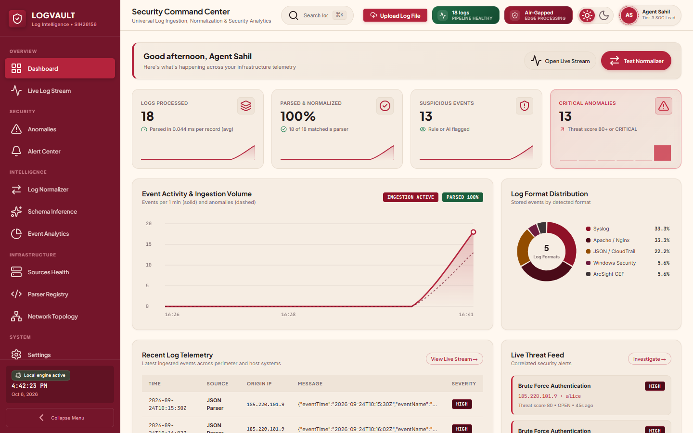

</div>

---

## 🎯 The Problem

A Security Operations Center receives logs from firewalls, web servers, Linux and Windows machines, cloud platforms and custom devices — and **every source speaks a different format**. Before anyone can spot an attack, analysts have to:

- 📄 **Read Syslog, JSON, XML, CEF, CSV and proprietary formats** that no single tool understands
- 🧩 **Write and maintain a parser** for every new log source
- 🔍 **Pick out the real threats** from thousands of normal events, then investigate each one by hand
- ☁️ **Avoid cloud tools entirely**, because defence, power and banking networks are not allowed to send logs outside

---

## 💡 Our Solution

**LOGVAULT turns messy, mixed logs into clean, standard, investigated events — on a single machine, without the internet.**

<table>
<tr>
<td width="25%" align="center" valign="top">

### 📥 Ingest
Drop a file or call the API. The format is **detected automatically** — even logs wrapped inside JSON by shippers like Filebeat.

</td>
<td width="25%" align="center" valign="top">

### 🔄 Normalize
Every record becomes an **OCSF 1.1** event, **validated** against the schema, with the raw log kept alongside.

</td>
<td width="25%" align="center" valign="top">

### 🚨 Detect
Rules flag attacks and name the **MITRE ATT&CK** technique; a local AI adds a second opinion.

</td>
<td width="25%" align="center" valign="top">

### ✅ Decide
The AI investigates each alert; an **analyst approves**, blocks the source, and exports evidence.

</td>
</tr>
</table>

<div align="center">

| 🗂️ **10+** log formats | ⚡ **~0.1 ms** to parse a record | 📤 **6** SIEM / data-lake exports | 🌐 **0** internet calls | ✅ **70** automated tests |
|:-:|:-:|:-:|:-:|:-:|

</div>

> **The demo in one sentence:** upload [`samples/demo-attack.log`](samples/demo-attack.log) — SSH brute force, SQL injection, XSS and path traversal mixed with normal traffic — and in about **30 ms** LOGVAULT parses all 14 records across 4 formats, flags the 10 attacks with their MITRE techniques, pins the attackers on a world map, and queues AI investigations for an analyst to approve.

---

## 📸 A Look Inside

<table>
<tr>
<td width="50%" valign="top">

**Log Normalizer** — any record, explained field by field: detected format, OCSF class, severity, MITRE technique, PII check and OCSF validation.

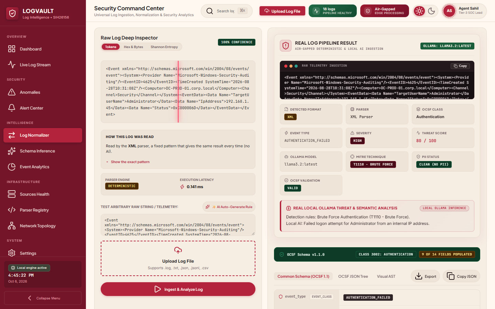

</td>
<td width="50%" valign="top">

**3D Threat Graph** — who the attacker touched: hosts, users and detection rules, with event counts on every link.

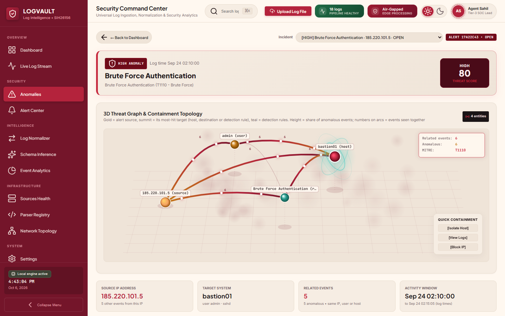

</td>
</tr>
<tr>
<td width="50%" valign="top">

**Alert Center** — the AI's verdict on every alert, waiting for an analyst to approve, reject or investigate.

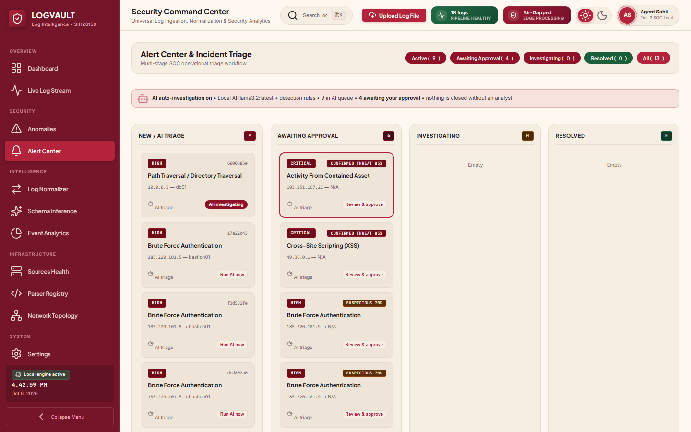

</td>
<td width="50%" valign="top">

**Schema Mapper** — teach LOGVAULT an unknown format from one sample; the saved rule parses every later record.

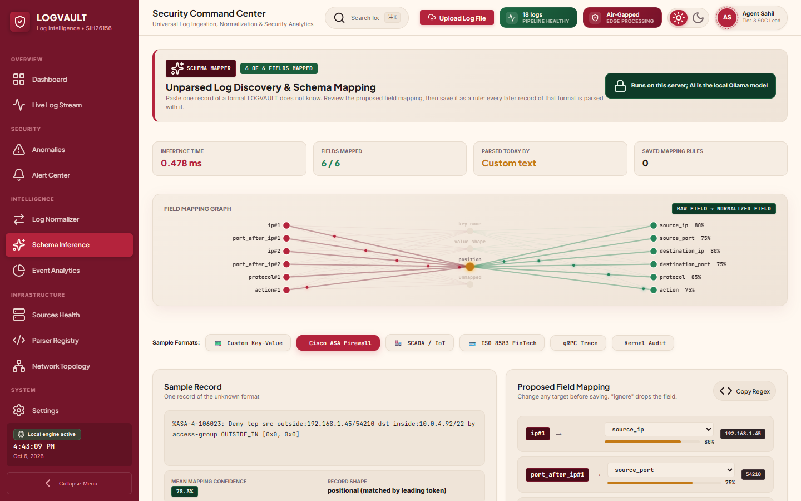

</td>
</tr>
<tr>
<td width="50%" valign="top">

**Threat Radar** — attack origins on a world map, resolved from an offline database.

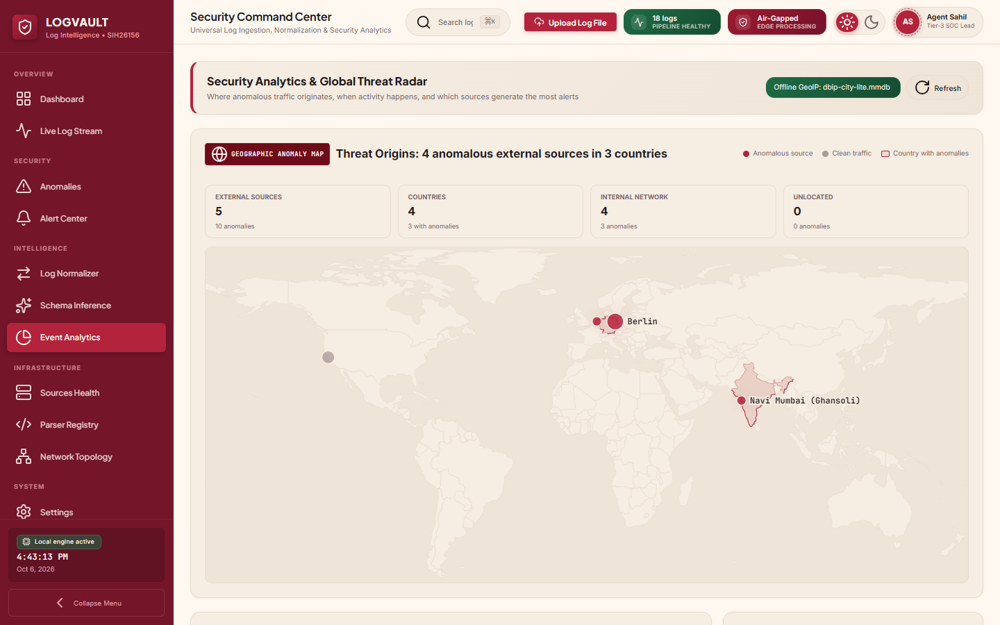

</td>
<td width="50%" valign="top">

**Reporting Sources** — every host and IP that sent logs, with volume, anomalies and one-click containment.

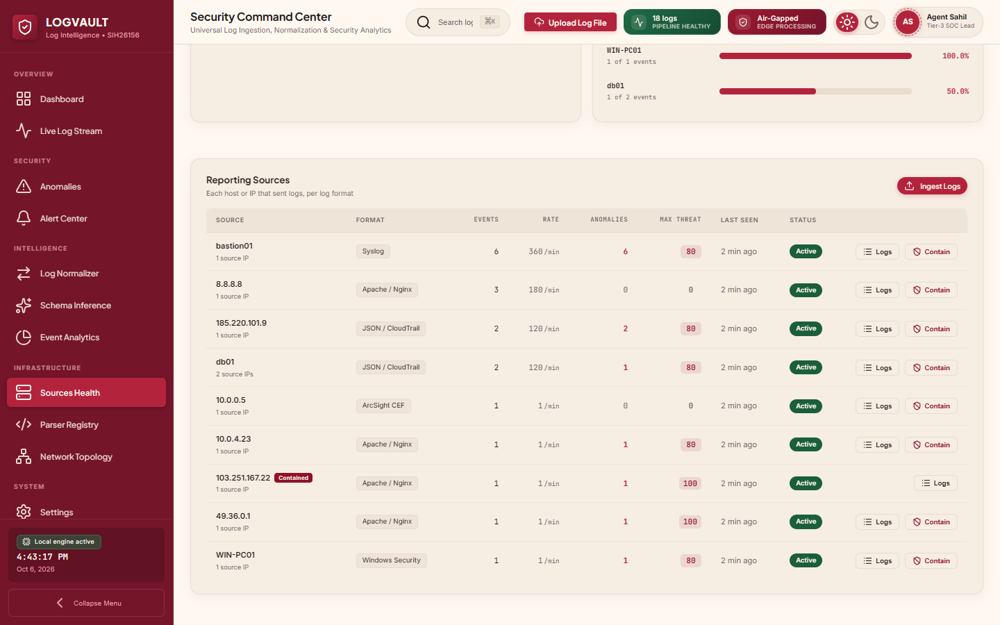

</td>
</tr>
<tr>
<td width="50%" valign="top">

**Audit Log** — every sign-in, change and export, in a SHA-256 hash chain that exposes any tampering.

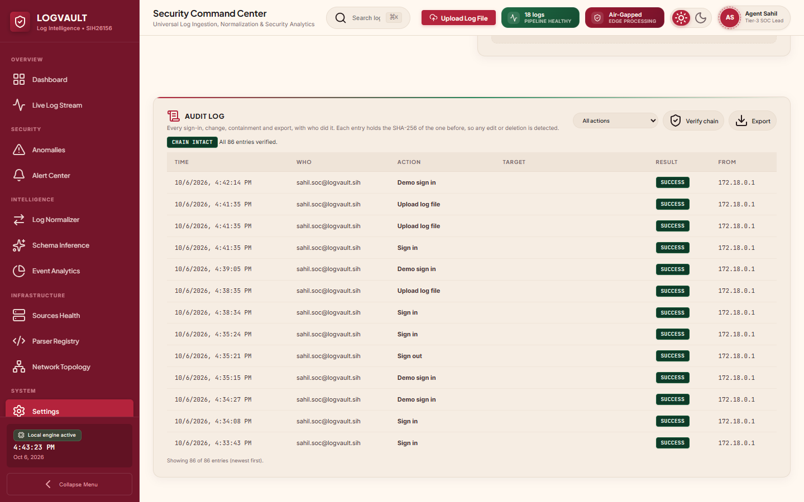

</td>
<td width="50%" valign="top">

**Sign-in** — real accounts with hashed passwords and four roles.

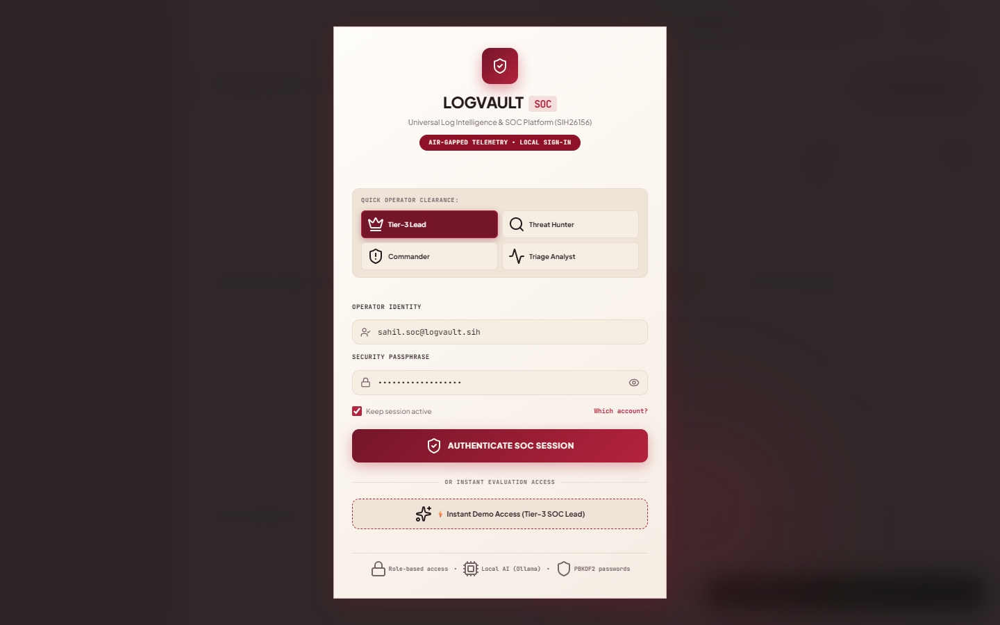

</td>
</tr>
</table>

---

## ⚡ Try It in 2 Minutes

**1. Start LOGVAULT** — needs [Docker Desktop](https://www.docker.com/products/docker-desktop/)

```bash
docker compose up -d --build
```

**2. Open** 👉 **http://localhost:8000/?auth=demo** — signs you in as the evaluation SOC lead.

**3. Follow an attack:**

| # | Go to | Do this | You will see |
|:-:|:--|:--|:--|
| 1 | **Log Normalizer** | Upload [`samples/demo-attack.log`](samples/demo-attack.log) | 14 records, 4 formats, 10 threats — each mapped to OCSF and MITRE ATT&CK |
| 2 | **Log Normalizer** | Click any red record | Severity, technique, threat score and a plain-English explanation |
| 3 | **Alert Center** | Wait a few seconds | The AI's verdict, root cause, evidence and recommended actions on every alert |
| 4 | **Alert Center** | Click **Approve + related** | All brute-force alerts from the same attacker closed at once — with your name on it |
| 5 | **Anomalies** | Click **Block IP** | The attacker is contained; any new log from it becomes CRITICAL, and firewall rules can be exported |
| 6 | **Event Analytics** | Just look | Attackers on the world map, an activity heatmap and the top sources |

Also try [`samples/cloud-audit.json`](samples/cloud-audit.json) — a cloud audit export split and understood automatically.

<details>
<summary><b>👤 Evaluation accounts</b></summary>

Created on first start. Passwords are checked by the server (PBKDF2-hashed), and each role limits what the account may do.

| Account | Password | Role |
|:--|:--|:--|
| `sahil.soc@logvault.sih` | `CyberSecurity2026!` | Tier-3 SOC Lead — everything |
| `rajesh.cmd@logvault.sih` | `Command2026!` | Incident Commander — everything |
| `vikram.hunt@logvault.sih` | `ThreatHunter2026!` | Tier-2 Analyst — containment, mapping rules |
| `sneha.triage@logvault.sih` | `TriageAnalyst2026!` | Tier-1 Analyst — triage only |

For a real deployment set `LOGVAULT_SEED_OPERATORS=false` and `LOGVAULT_DEMO_LOGIN=false`, and change passwords in **Settings**.

</details>

<details>
<summary><b>🐍 Run without Docker</b></summary>

```bash
pip install -r backend/requirements.txt
python -m backend.serve          # or: python -m uvicorn backend.app:app --port 8000
```

Tested with Python 3.13. Then open http://localhost:8000/?auth=demo

</details>

<details>
<summary><b>🤖 Turn on the local AI (optional)</b></summary>

LOGVAULT works fully without AI — rules still detect, explain and recommend. To add AI investigations, install [Ollama](https://ollama.com):

```bash
ollama pull llama3.2       # or llama3.2:1b for slower machines
ollama serve
```

The top bar shows **LOCAL AI READY** once the model is loaded. On Linux with Docker, start Ollama with `OLLAMA_HOST=0.0.0.0 ollama serve` so the container can reach it.

</details>

<details>
<summary><b>🌍 Turn on the world map (one-time download)</b></summary>

The IP location database (~120 MB) is not stored in git. Download it once on a connected machine, then rebuild:

```bash
python scripts/download_geoip.py
docker compose up -d --build
```

</details>

<details>
<summary><b>🔎 Turn on OpenSearch (optional)</b></summary>

SQLite stores and searches everything by default. To add a full-text OpenSearch index:

```bash
OPENSEARCH_URL=http://opensearch:9200 docker compose --profile opensearch up -d --build
```

Every stored event is then also indexed as an OCSF document, and the Live Log Stream search uses it — falling back to SQLite automatically if OpenSearch is unavailable.

</details>

---

## 🗂️ Supported Log Formats

| Format | Example | What LOGVAULT extracts |
|:--|:--|:--|
| **Syslog RFC 5424** | `<34>1 2026-09-24T02:10:00Z host sshd 330 - - Failed password…` | Facility, severity, host, process, structured data, SSH / PAM / sudo / iptables details |
| **Syslog RFC 3164** | `Sep 24 02:10:00 bastion01 sshd[330]: Failed password for admin from 185.220.101.5…` | Same, with or without the `<PRI>` header |
| **JSON / JSON Lines** | `{"eventName":"ConsoleLogin","sourceIPAddress":"203.0.113.7"}` | Common field names (CloudTrail, ECS, app logs) mapped to one schema |
| **Logs wrapped in JSON** | `{"timestamp":"…","log":"Jul 15 12:34:56 server01 sshd[…]"}` | The inner log read by its own parser — the Filebeat / Docker / Fluentd way |
| **CEF (ArcSight)** | `CEF:0\|PaloAltoNetworks\|PAN-OS\|…\|src=185.220.101.5 dst=10.0.0.15` | Vendor, signature, severity and every extension field |
| **XML** | `<Event><System><EventID>4625</EventID>…</Event>` | Windows Event XML (security events classified) and any generic XML; XXE-safe |
| **CSV** | `timestamp,src_ip,user,action` | Rows with or without a header row |
| **Apache / Nginx** | `192.168.1.50 - frank [02/Sep/2026:19:34:02 +0000] "GET /login" 401` | Client IP, user, method, URL, status |
| **Windows key=value** | `EventID=4625 AccountName=administrator SourceIP=10.0.4.23` | Event ID meaning, account, workstation, source IP |
| **Custom text** | `user carol failed login from 172.16.9.9 port 22` | IPs, ports, users, times and HTTP requests found by their shape |
| **Your own format** | `%ASA-4-106023: Deny tcp src outside:192.168.1.45/54210…` | Whatever you map once in the **Schema Mapper** — saved as a reusable rule |

---

## 🧭 How It Works

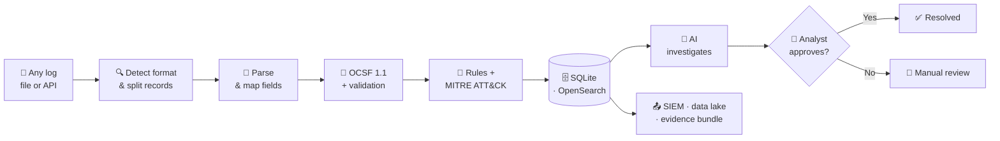
```mermaid
flowchart LR
    A["📄 Any log<br/>file or API"] --> B["🔍 Detect format<br/>& split records"]
    B --> C["🧩 Parse<br/>& map fields"]
    C --> D["📐 OCSF 1.1<br/>+ validation"]
    D --> E["🚨 Rules +<br/>MITRE ATT&CK"]
    E --> F[("🗄️ SQLite<br/>· OpenSearch")]
    F --> G["🤖 AI<br/>investigates"]
    G --> H{"👤 Analyst<br/>approves?"}
    H -- Yes --> I["✅ Resolved"]
    H -- No --> J["🔎 Manual review"]
    F --> K["📤 SIEM · data lake<br/>· evidence bundle"]
```

<details>
<summary><b>One log line, start to finish</b></summary>

**Input**

```text
Sep 24 02:10:00 bastion01 sshd[330]: Failed password for admin from 185.220.101.5 port 50211 ssh2
```

**Output**

| Field | Value |
|:--|:--|
| Detected format | `syslog` — parsed in ~0.1 ms |
| Event type | `AUTHENTICATION_FAILED` |
| OCSF | class 3002 *Authentication* · activity *Logon* · status *Failure* · `type_uid 300201` · ✅ valid |
| User · Host | `admin` · `bastion01` |
| Source IP | `185.220.101.5` → Berlin, Germany *(offline lookup)* |
| Detection | Brute Force Authentication · **T1110 – Brute Force** |
| AI verdict | Confirmed threat, with root cause and recommended actions — waiting for analyst approval |

</details>

---

## ✨ Features

**📥 Ingest & normalize**
- **Automatic format detection** across 10+ formats, including logs wrapped inside JSON
- **Plug-and-play onboarding** — the Schema Mapper proposes field mappings for an unknown format; save it once and every later record is parsed with it
- **OCSF 1.1 events, validated** — class, category, activity and severity IDs, endpoints, actor and MITRE attacks, checked against the schema on every record
- **Raw ↔ normalized traceability** — the original line always stays linked to its normalized event
- **Privacy protection** — email addresses, ID numbers and card numbers are masked automatically

**🚨 Detect & investigate**
- **Attack detection** — SQL injection, XSS, path traversal, brute force, command execution, privilege escalation, data exfiltration and obfuscated payloads
- **MITRE ATT&CK mapping** — every finding names the technique, e.g. *T1110 – Brute Force*
- **AI investigation** — correlates related events and proposes a verdict, root cause and actions
- **Human approval** — only an analyst can close an alert; every decision is recorded
- **3D threat graph, world map and heatmap** — see who attacked what, from where, and when

**🛡️ Respond & export**
- **Containment** — block an IP or isolate a host; new activity from it becomes CRITICAL, and the list exports as iptables, Cisco ACL or Windows Firewall rules
- **SIEM & data-lake export** — OCSF JSON Lines (plain or gzip), CSV, CEF (ArcSight / QRadar), Splunk HEC and Elasticsearch / OpenSearch bulk
- **Forensic evidence** — per-alert dossiers and bundles with a SHA-256 manifest, optionally AES-256 encrypted

**🔐 Security by design**
- **Sign-in with roles** — PBKDF2-hashed passwords, session tokens, four roles
- **Tamper-evident audit log** — every action in a SHA-256 hash chain, verifiable from Settings
- **Optional HTTPS**, **storage limits and retention**, and an **evidence fingerprint** over everything stored

---

## 🤖 AI That Investigates, a Human Who Decides

Most "AI security" tools either do nothing on their own or act without asking. LOGVAULT does the work **and keeps the analyst in control.**

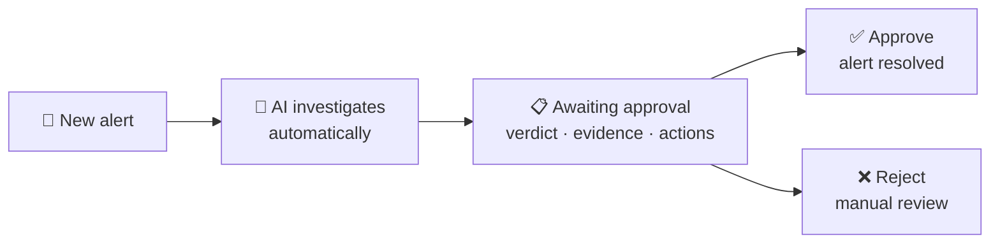
```mermaid
flowchart LR
    A["🚨 New alert"] --> B["🤖 AI investigates<br/>automatically"]
    B --> C["📋 Awaiting approval<br/>verdict · evidence · actions"]
    C --> D["✅ Approve<br/>alert resolved"]
    C --> E["❌ Reject<br/>manual review"]
```

- **Two opinions, the safer one wins.** Rules and the AI each give a verdict; if they disagree, LOGVAULT keeps the more cautious one, so a weak AI answer can never hide a real attack.
- **Parsing never waits for the AI.** Logs are parsed and checked by rules in about 0.1 ms; the AI investigates in the background.
- **Fast on bursts.** Repeated alerts from one attacker share one AI opinion and can be approved together.
- **Accountable.** Every approval records who decided, when and why.
- **Works without AI.** With no model installed, rule-based investigation still gives a verdict and actions.

---

## 🔒 Built for Air-Gapped Networks

The LOGVAULT server makes **zero internet calls**. Everything it needs runs on the same machine.

| Component | Where it runs |
|:--|:--|
| Web interface and API | Local server (FastAPI) |
| Log store | Local SQLite file, kept across restarts |
| Full-text search | SQLite, or a local OpenSearch container — optional |
| AI model | Local Ollama — optional |
| IP → location | Local database file |
| World map | Bundled with the app |

> The web page loads its typefaces from Google Fonts when online; on an offline network the browser uses system fonts and everything works the same.

<details>
<summary><b>Moving LOGVAULT into an air-gapped network</b></summary>

```bash
# On a connected machine
python scripts/download_geoip.py
docker compose build
docker save logvault:latest -o logvault.tar
ollama pull llama3.2            # optional — copy ~/.ollama/models across too

# On the air-gapped machine
docker load -i logvault.tar
docker compose up -d
```

</details>

---

## 🏆 Why LOGVAULT Is Different

| | Cloud SIEM | Manual analysis | **LOGVAULT** |
|:--|:-:|:-:|:-:|
| Works without internet | ❌ | ✅ | ✅ |
| Understands many log formats automatically | ✅ | ❌ | ✅ |
| New formats without writing code | ⚠️ | ❌ | ✅ |
| Explains alerts in plain language | ⚠️ Paid add-on | ❌ | ✅ |
| Analyst stays in control of every decision | ⚠️ | ✅ | ✅ |
| Data never leaves the organisation | ❌ | ✅ | ✅ |
| Setup time | Weeks | — | **One command** |

---

## 🛠️ Tech Stack

| Layer | Technology |
|:--|:--|
| Backend | Python 3.13 · FastAPI · SQLite · OpenSearch *(optional)* |
| AI | Ollama · Llama 3.2 — runs locally |
| Frontend | HTML · CSS · JavaScript — no framework, no build step |
| Standards | OCSF 1.1 · MITRE ATT&CK · CEF · Splunk HEC |
| Security | PBKDF2 · AES-256-GCM · SHA-256 hash chains · TLS |
| Deployment | Docker · Docker Compose |
| Quality | 70 automated tests — `python -m pytest backend/tests` |

---

## 📌 Current Scope & Roadmap

**Today's limits, stated plainly**

- 📥 Logs arrive by **upload or REST API** — there is no network syslog listener or collector agent yet.
- 🛑 **Containment produces firewall rules; it does not change the firewall itself** — applying them stays with the network team.
- 🔒 **HTTPS is optional** (`LOGVAULT_TLS=true`); the SQLite file is not encrypted on disk, so use disk encryption on the host.
- 🧠 Small local models can be wrong — which is why rules keep the verdict cautious and a human approves.

**What's next**

- [ ] Syslog listener (UDP/TCP 514) and a lightweight collector agent
- [ ] Cross-record correlation — brute-force bursts, impossible travel
- [ ] Encryption of the database at rest
- [ ] Direct firewall integration for one-click blocking

---

<details>
<summary><b>📚 Technical reference — configuration, API, project structure</b></summary>

### Configuration

Set in `.env` (copy [`.env.example`](.env.example)) or as environment variables.

| Variable | Default | Purpose |
|:--|:--|:--|
| `LOGVAULT_PORT` | `8000` | Port on the host |
| `OLLAMA_HOST` | Docker: `http://host.docker.internal:11434` | Local Ollama server |
| `OLLAMA_DEFAULT_MODEL` | `llama3.2` | Preferred model |
| `BATCH_AI_LINES` | `0` | Records per upload analysed by AI during the upload (0 = instant upload) |
| `AUTO_INVESTIGATE` · `INVESTIGATE_INTERVAL` | `true` · `5` | Investigate new alerts automatically, every N seconds |
| `STORAGE_LIMIT_GB` · `RETENTION_DAYS` | `0` · `0` | Default size limit and retention (0 = unlimited / forever) |
| `GEOIP_DIR` | `geoip/` | Folder with the `.mmdb` location database |
| `LOGVAULT_AUTH` | `true` | Require sign-in for every API call |
| `LOGVAULT_SEED_OPERATORS` | `true` | Create the four evaluation accounts on first start |
| `LOGVAULT_DEMO_LOGIN` | `true` | Allow one-click demo sign-in and `?auth=demo` |
| `LOGVAULT_TLS` | `false` | Serve HTTPS (`data/tls/cert.pem` + `key.pem`, self-signed if absent) |
| `OPENSEARCH_URL` | *(empty = off)* | e.g. `http://opensearch:9200` with the `opensearch` compose profile |
| `OPENSEARCH_INDEX` · `OPENSEARCH_USER` · `OPENSEARCH_PASSWORD` | `logvault-ocsf-v1` | Index name and credentials |

### API

Interactive documentation: **http://localhost:8000/docs**. Every call except health and sign-in needs the bearer token from `/api/auth/login`.

| Method | Endpoint | Purpose |
|:--|:--|:--|
| `POST` | `/api/auth/login` · `/api/auth/logout` | Sign in (returns a bearer token) and out |
| `POST` | `/api/normalize` · `/api/upload` | Normalize one log `{"raw": "..."}` · upload a file |
| `GET` | `/api/events` · `/api/anomalies` · `/api/alerts` | Stored events, threats, alerts |
| `POST` | `/api/alerts/{id}/investigate` · `/approve` · `/reject` | AI investigation and analyst decision |
| `GET` | `/api/dashboard` · `/api/collectors` · `/api/analytics/geo` · `/api/analytics/heatmap` | Dashboard, sources, map and activity data |
| `GET` · `POST` | `/api/parsers` · `/api/parsers/benchmark` | Parser catalog and timed test runs |
| `POST` · `GET` | `/api/mapper/infer` · `/api/mapper/rules` | Field mapping for unknown formats, saved rules |
| `GET` · `POST` · `DELETE` | `/api/containment` · `/api/containment/export` | Block IPs / isolate hosts; export firewall rules |
| `GET` | `/api/export/siem?format=` | `ocsf-jsonl` · `ocsf-jsonl-gz` · `csv` · `cef` · `splunk-hec` · `elastic-bulk` |
| `POST` · `GET` | `/api/export/bundle` · `/api/alerts/{id}/dossier` · `/api/export/ocsf` | Evidence bundle (optionally encrypted), dossier, OCSF definitions |
| `GET` | `/api/audit` · `/api/audit/verify` · `/api/integrity` · `/api/system/status` | Audit log, chain check, evidence fingerprint, security status |
| `GET` · `POST` | `/api/search/status` · `/api/search/reindex` | OpenSearch status and re-indexing |

### Project structure

```text
LOGVAULT/
├── backend/                 Python API (FastAPI)
│   ├── app.py · serve.py    Server, frontend hosting, background workers, HTTPS
│   ├── api.py               REST endpoints
│   ├── parsers/             Syslog, JSON, CEF, XML, CSV, Apache, Windows, key=value, custom text
│   ├── schema/ocsf.py       OCSF 1.1 conversion and validation
│   ├── mitre/               Detection rules with MITRE ATT&CK mapping
│   ├── ai/                  Ollama adapter, prompts, alert investigator
│   ├── mapper.py            Schema Mapper and saved mapping rules
│   ├── audit.py             Hash-chained audit log
│   ├── export.py            SIEM / data-lake exports, evidence bundles
│   └── tests/               70 automated tests (pytest)
├── frontend/                Web interface — one JS module per screen
├── samples/                 Demo log files
├── scripts/                 GeoIP download, world map generator, bundle decryptor
├── docs/screenshots/        Images used in this README
├── Dockerfile · docker-compose.yml · .env.example
└── LICENSE
```

</details>

<details>
<summary><b>🙏 Credits</b></summary>

- IP geolocation by **[DB-IP](https://db-ip.com)** — IP to City Lite, [CC BY 4.0](https://creativecommons.org/licenses/by/4.0/)
- World map outlines from **[Natural Earth](https://www.naturalearthdata.com)** (public domain)
- Icons by **[Lucide](https://lucide.dev)** (ISC)
- Local AI by **[Ollama](https://ollama.com)** and Meta **Llama 3.2**
- Event schema by the **[Open Cybersecurity Schema Framework](https://ocsf.io)**

</details>

---

<div align="center">

### 🛡️ LOGVAULT

**Any log. One schema. Every alert investigated. Every decision human.**

Built for **Smart India Hackathon 2026** · SIH26156 · Team **BetterCallCode**

[Sahil](https://github.com/Sahil-242-ops) · [Aman Gupta](https://github.com/amanguptawork124-collab)

[MIT License](LICENSE)

</div>
